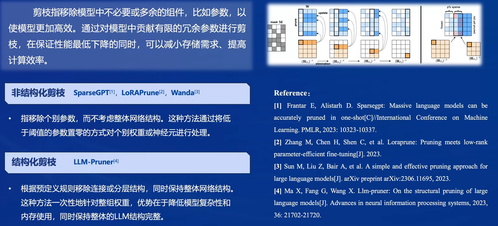

[Class5. LMDeploy 量化部署 LLM \& VLM实践](#class5-lmdeploy-量化部署-llm--vlm实践)
- [Class5. LMDeploy 量化部署 LLM \& VLM实践](#class5-lmdeploy-量化部署-llm--vlm实践)
  - [1. 大模型部署背景](#1-大模型部署背景)
    - [1.1 具体面临的挑战：](#11-具体面临的挑战)
      - [1.1.1 计算量巨大](#111-计算量巨大)
      - [1.1.2 内存开销巨大](#112-内存开销巨大)
      - [1.1.2 访存瓶颈](#112-访存瓶颈)
  - [2. 大模型部署方法](#2-大模型部署方法)
    - [2.1 模型剪枝（Pruning）](#21-模型剪枝pruning)
    - [2.2 知识蒸馏（Knowledge Distillation, KD）](#22-知识蒸馏knowledge-distillation-kd)
    - [2.3 量化（Quantization）](#23-量化quantization)
      - [2.3.1 核心思想：将浮点数转换为整数或者其他离散形式。](#231-核心思想将浮点数转换为整数或者其他离散形式)
      - [2.3.2 量化提高计算效率原因](#232-量化提高计算效率原因)
  - [3. LMDeploy简介](#3-lmdeploy简介)
    - [3.1 主要核心功能](#31-主要核心功能)
      - [3.1.1 模型高效推理TurboMind (Imdeploy chat -h)](#311-模型高效推理turbomind-imdeploy-chat--h)
      - [3.1.2 模型量化压缩 (Imdeploy lite -h)](#312-模型量化压缩-imdeploy-lite--h)
      - [3.1.3 服务化部署 (Imdeploy serve -h)](#313-服务化部署-imdeploy-serve--h)
      - [3.1.4 性能表现](#314-性能表现)
      - [3.1.5 推理视觉多模态大模型](#315-推理视觉多模态大模型)
      - [3.1.6 可支持模型（更多详见Github网址）](#316-可支持模型更多详见github网址)
  - [4. 动手实践环节](#4-动手实践环节)
    - [4.1 安装依赖](#41-安装依赖)
    - [4.2 LMDeploy模型对话(chat)](#42-lmdeploy模型对话chat)
      - [4.2.1 Huggingface与TurboMind](#421-huggingface与turbomind)
        - [HuggingFace](#huggingface)
        - [TurboMind](#turbomind)
      - [4.2.2 模型下载 （基础作业）](#422-模型下载-基础作业)
        - [4.2.2.1 从InternStudio开发机使用模型](#4221-从internstudio开发机使用模型)
        - [4.2.2.2 本地下载模型](#4222-本地下载模型)
      - [4.2.3 使用Transformer库运行模型 （基础作业）](#423-使用transformer库运行模型-基础作业)
      - [4.2.4 使用LMDeploy对话 （基础作业）](#424-使用lmdeploy对话-基础作业)
    - [4.3 LMDeploy模型量化(lite)](#43-lmdeploy模型量化lite)
      - [4.3.1 设置最大KV Cache缓存大小](#431-设置最大kv-cache缓存大小)
        - [4.3.1.1 KV Cache基本概念](#4311-kv-cache基本概念)
      - [4.3.2 使用 W4A16 量化](#432-使用-w4a16-量化)
      - [4.3.2 进阶作业1（优秀学员必做）](#432-进阶作业1优秀学员必做)
    - [4.4 LMDeploy 服务（serve）](#44-lmdeploy-服务serve)
      - [4.4.1 启动API服务器](#441-启动api服务器)
      - [4.4.2 命令行客户端连接API服务器](#442-命令行客户端连接api服务器)
      - [4.4.3 网页客户端连接API服务器](#443-网页客户端连接api服务器)
      - [4.4.4 进阶作业2（优秀学员必做）](#444-进阶作业2优秀学员必做)
    - [4.5 Python代码集成](#45-python代码集成)
      - [4.5.1 Python代码集成运行1.8B模型](#451-python代码集成运行18b模型)
      - [4.5.2 向TurboMind后端传递参数](#452-向turbomind后端传递参数)
      - [4.5.3 进阶作业3（优秀学员必做）](#453-进阶作业3优秀学员必做)
    - [4.6 使用LMDeploy运行视觉多模态大模型llava（优秀学员必做）](#46-使用lmdeploy运行视觉多模态大模型llava优秀学员必做)
    - [4.7 使用LMDeploy运行第三方大模型](#47-使用lmdeploy运行第三方大模型)

# Class5. LMDeploy 量化部署 LLM & VLM实践

视频链接：https://www.bilibili.com/video/BV1tr421x75B/?vd_source=39aa961652f56a2108d0e044c3c8f710
课程文档：https://github.com/InternLM/Tutorial/blob/camp2/lmdeploy/README.md
课程作业：https://github.com/InternLM/Tutorial/blob/camp2/lmdeploy/homework.md
Github地址：https://github.com/InternLM/LMDeploy

## 1. 大模型部署背景

就是把训练好的模型部署到一个特定的环境，可以部署在边缘设备，移动端，或者服务器上。

在部署的时候难免会存在以下问题：
1. 如果部署到多卡、集群的话，如何实现分布式推理？
2. 如果部署到手机，算力是否足够？怎么量化用于优化？


### 1.1 具体面临的挑战：

#### 1.1.1 计算量巨大 
OpenAI公司在`Scaling law` 的论文中，提出一个大模型前向推理所需计算量的计算公式，如下图所示

如果大模型参数量为20B，每生成一个 token ，就要进行**406亿**次浮点运算。如果回答的话中有128个token，要**5.2万亿**次浮点运算


#### 1.1.2 内存开销巨大 

20B模型加载就要40G+显存，缓存要10.3G


#### 1.1.2 访存瓶颈

Transformer在推理过程中是一个访存密集型任务，除了计算，还需要往显存中获取数据，还会产生中间结果会写入显存。

以4090为例，算力为82.58万亿次每秒，但是 1008G/s 的显存带宽拖后腿，大部分时间都用在了数据交换上


## 2. 大模型部署方法

### 2.1 模型剪枝（Pruning）
 分为结构化剪枝于结构化剪枝，用于删去冗余参数



### 2.2 知识蒸馏（Knowledge Distillation, KD）

**核心思想**：从存在冗余参数中，推断出模型有潜力通过更少的参数量来达到同等或者更好的效果。

先训练一个大模型，为Teacher网络，再去让Teacher网络训练一个参数量少的的Student网络，从而降低训练难度。


### 2.3 量化（Quantization）

#### 2.3.1 核心思想：将浮点数转换为整数或者其他离散形式。

一般存储方式都是32位浮点数，即 占用4个字节。在不影响效果的前提下，降低存储空间。而且模型量化能够提高计算效率。

#### 2.3.2 量化提高计算效率原因

大模型推理时是一种访存密集型任务，访存的性能瓶颈是远大于计算的瓶颈。通过量化，可以将访存量降低，比如原来是32位，量化为16位，访存量降低为原来的1/2，从而降低数据传输的时间，提升运算效率

!

## 3. LMDeploy简介


### 3.1 主要核心功能

#### 3.1.1 模型高效推理TurboMind (Imdeploy chat -h)

1. LLaMa 结构模型的支持。国内现在很多开源模型都是基于LLaMa结构设计的
2. 针对请求数量不确定，请求生成长度不确定的问题，提出continuous batch推理模式
3. 开发KV缓存管理器，推理过程中会有频繁的KV缓存操作，暂时不用的从显存中拿出来放到内存中，在需要用的时候放入显存

#### 3.1.2 模型量化压缩 (Imdeploy lite -h)

**使用W4A16量化(AWQ)**：将FP16的模型权重量化为INT4，Kernel计算时，访存量直接降为FP16模型的1/4，大幅降低了访存成本。Weight Only是指仅量化权重，数值计算依然采用FP16(需要将INT4权重反量化)。

#### 3.1.3 服务化部署 (Imdeploy serve -h)

将LLM封装为HTTP API服务，支持Triton拓展。


#### 3.1.4 性能表现


#### 3.1.5 推理视觉多模态大模型
支持llava模型推理


#### 3.1.6 可支持模型（更多详见Github网址）


## 4. 动手实践环节

### 4.1 安装依赖

激活创建的虚拟环境。

```sh
conda activate lmdeploy
```

安装0.3.0版本的lmdeploy。

```sh
pip install lmdeploy[all]==0.3.0
```
### 4.2 LMDeploy模型对话(chat)

####  4.2.1 Huggingface与TurboMind 

##### HuggingFace

[HuggingFace](https://huggingface.co/)是一个高速发展的社区，包括Meta、Google、Microsoft、Amazon在内的超过5000家组织机构在为HuggingFace开源社区贡献代码、数据集和模型。可以认为是一个针对深度学习模型和数据集的在线托管社区，如果你有数据集或者模型想对外分享，网盘又不太方便，就不妨托管在HuggingFace。

托管在HuggingFace社区的模型通常采用HuggingFace格式存储，简写为**HF格式**。

但是HuggingFace社区的服务器在国外，国内访问不太方便。国内可以使用阿里巴巴的[MindScope](https://www.modelscope.cn/home)社区，或者上海AI Lab搭建的[OpenXLab](https://openxlab.org.cn/home)社区，上面托管的模型也通常采用**HF格式**。

##### TurboMind 

TurboMind是LMDeploy团队开发的一款关于LLM推理的高效推理引擎，它的主要功能包括：LLaMa 结构模型的支持，continuous batch 推理模式和可扩展的 KV 缓存管理器。

TurboMind推理引擎仅支持推理TurboMind格式的模型。因此，TurboMind在推理HF格式的模型时，会首先自动将HF格式模型转换为TurboMind格式的模型。**该过程在新版本的LMDeploy中是自动进行的，无需用户操作。**

**几个注意的点**：
* TurboMind与LMDeploy的关系：LMDeploy是涵盖了LLM 任务全套轻量化、部署和服务解决方案的集成功能包，TurboMind是LMDeploy的一个推理引擎，是一个子模块。LMDeploy也可以使用pytorch作为推理引擎。
* TurboMind与TurboMind模型的关系：TurboMind是推理引擎的名字，TurboMind模型是一种模型存储格式，TurboMind引擎只能推理TurboMind格式的模型。

#### 4.2.2 模型下载 （<font color = red>基础作业</font>）

##### 4.2.2.1 从InternStudio开发机使用模型

如果是在InternStudio开发机上，以前提前下载好了。

```sh
ls /root/share/new_models/Shanghai_AI_Laboratory/
```
首先进入一个你想要存放模型的目录，本教程统一放置在Home目录。执行如下指令：

```sh
cd ~
```

然后执行如下指令由开发机的共享目录**软链接**或**拷贝**模型： 

```sh
ln -s /root/share/new_models/Shanghai_AI_Laboratory/internlm2-chat-1_8b /root/LMDeploy
# cp -r /root/share/new_models/Shanghai_AI_Laboratory/internlm2-chat-1_8b /root/LMDeploy
```

截图为证：


##### 4.2.2.2 本地下载模型

由OpenXLab平台下载模型

注意，如果你在上一步已经从InternStudio开发机上下载了模型，这一步就没必要执行了。

<details>

上一步介绍的方法只适用于在InternStudio开发机上下载模型，如果是在自己电脑的开发环境上，也可以由[OpenXLab](https://openxlab.org.cn/usercenter/OpenLMLab?vtab=create&module=datasets)下载。*在开发机上还是建议通过拷贝的方式，因为从OpenXLab平台下载会占用大量带宽~*

首先进入一个你想要存放模型的目录，本教程统一放置在Home目录。执行如下指令：

```sh
cd ~
```

OpenXLab平台支持通过Git协议下载模型。首先安装git-lfs组件。

* 对于root用于请执行如下指令：

```sh
curl -s https://packagecloud.io/install/repositories/github/git-lfs/script.deb.sh | bash
apt update
apt install git-lfs   
git lfs install  --system
```

* 对于非root用户需要加sudo，请执行如下指令：

```sh
curl -s https://packagecloud.io/install/repositories/github/git-lfs/script.deb.sh | sudo bash
sudo apt update
sudo apt install git-lfs   
sudo git lfs install  --system
```

安装好git-lfs组件后，由OpenXLab平台下载InternLM2-Chat-1.8B模型：

```sh
git clone https://code.openxlab.org.cn/OpenLMLab/internlm2-chat-1.8b.git
```

这一步骤可能耗时较长，主要取决于网速，耐心等待即可。

下载完成后，运行`ls`指令，可以看到当前目录下多了一个`internlm2-chat-1.8b`文件夹，即下载好的预训练模型。

```sh
ls
```

注意！从OpenXLab平台下载的模型文件夹命名为`1.8b`，而从InternStudio开发机直接拷贝的模型文件夹名称是`1_8b`，为了后续文档统一，这里统一命名为`1_8b`。

```sh
mv /root/internlm2-chat-1.8b /root/internlm2-chat-1_8b
```

</details>

#### 4.2.3 使用Transformer库运行模型 （<font color = red>基础作业</font>）

创建python文件
```bash
touch /root/pipeline_transformer.py
```
粘贴代码
```python
import torch
from transformers import AutoTokenizer, AutoModelForCausalLM

tokenizer = AutoTokenizer.from_pretrained("/root/internlm2-chat-1_8b", trust_remote_code=True)

# Set `torch_dtype=torch.float16` to load model in float16, otherwise it will be loaded as float32 and cause OOM Error.
model = AutoModelForCausalLM.from_pretrained("/root/internlm2-chat-1_8b", torch_dtype=torch.float16, trust_remote_code=True).cuda()
model = model.eval()

inp = "hello"
print("[INPUT]", inp)
response, history = model.chat(tokenizer, inp, history=[])
print("[OUTPUT]", response)

inp = "please provide three suggestions about time management"
print("[INPUT]", inp)
response, history = model.chat(tokenizer, inp, history=history)
print("[OUTPUT]", response)

```
运行代码
```bash
conda activate lmdeploy
python /root/LMDeploy/pipeline_transformer.py
```
得到输出，截图为证


#### 4.2.4 使用LMDeploy对话 （<font color = red>基础作业</font>）

首先激活创建好的conda环境：

```sh
conda activate lmdeploy
```

使用LMDeploy与模型进行对话的通用命令格式为：

```sh
lmdeploy chat [HF格式模型路径/TurboMind格式模型路径]
```

例如，您可以执行如下命令运行下载的1.8B模型：

```sh
lmdeploy chat /root/LMDeploy/internlm2-chat-1_8b
```

截图为证


**拓展内容**：有关LMDeploy的chat功能的更多参数可通过-h命令查看。

```sh
lmdeploy chat -h
```

### 4.3 LMDeploy模型量化(lite)

本部分内容主要介绍如何对模型进行量化。主要包括 KV8量化和W4A16量化。总的来说，量化是一种以参数或计算中间结果精度下降换空间节省（以及同时带来的性能提升）的策略。

正式介绍 LMDeploy 量化方案前，需要先介绍两个概念：

* 计算密集（compute-bound）: 指推理过程中，绝大部分时间消耗在数值计算上；针对计算密集型场景，可以通过使用更快的硬件计算单元来提升计算速。
* 访存密集（memory-bound）: 指推理过程中，绝大部分时间消耗在数据读取上；针对访存密集型场景，一般通过减少访存次数、提高计算访存比或降低访存量来优化。

常见的 LLM 模型由于 Decoder Only 架构的特性，实际推理时大多数的时间都消耗在了逐 Token 生成阶段（Decoding 阶段），是典型的访存密集型场景。

那么，如何优化 LLM 模型推理中的访存密集问题呢？ 我们可以使用**KV8量化**和**W4A16**量化。

* KV8量化是指将逐 Token（Decoding）生成过程中的上下文 K 和 V 中间结果进行 INT8 量化（计算时再反量化），以降低生成过程中的显存占用。
* W4A16 量化，将 FP16 的模型权重量化为 INT4，Kernel 计算时，访存量直接降为 FP16 模型的 1/4，大幅降低了访存成本。Weight Only 是指仅量化权重，数值计算依然采用 FP16（需要将 INT4 权重反量化）

#### 4.3.1 设置最大KV Cache缓存大小

##### 4.3.1.1 KV Cache基本概念
KV Cache是一种缓存技术，通过存储键值对的形式来复用计算结果，以达到提高性能和降低内存消耗的目的。在大规模训练和推理中，KV Cache可以显著减少重复计算量，从而提升模型的推理速度。

理想情况下，KV Cache全部存储于显存，以加快访存速度。当显存空间不足时，也可以将KV Cache放在内存，通过缓存管理器控制将当前需要使用的数据放入显存。

模型在运行时，**占用的显存可大致分为三部分**：
- 模型参数本身占用的显存、
- KV Cache占用的显存
- 以及中间运算结果占用的显存。
  
LMDeploy的KV Cache管理器可以通过设置`--cache-max-entry-count`参数，控制KV缓存**占用剩余显存的最大比例**。默认的比例为0.8。

```sh
lmdeploy chat /root/LMDeploy/internlm2-chat-1_8b
```

与模型对话，查看右上角资源监视器中的显存占用情况。


此时显存占用为34056MB。下面，改变`--cache-max-entry-count`参数，设为0.5。

```sh
lmdeploy chat /root/LMDeploy/internlm2-chat-1_8b --cache-max-entry-count 0.5
```

与模型对话，再次查看右上角资源监视器中的显存占用情况。


看到显存占用明显降低，变为22984MB。

下面来一波“极限”，把`--cache-max-entry-count`参数设置为0.01，约等于禁止KV Cache占用显存。

```sh
lmdeploy chat /root/LMDeploy/internlm2-chat-1_8b --cache-max-entry-count 0.01
```


然后与模型对话，可以看到，此时显存占用仅为4872MB，代价是会降低模型推理速度。
 尝试了一下`写一个小故事`，近一分钟都没回复

 #### 4.3.2 使用 W4A16 量化

LMDeploy使用AWQ算法，实现模型4bit权重量化。

<details>

<summary>AWQ算法详情</summary>
AWQ（Adaptive Window Query）算法是一种用于数据流管理系统的查询优化技术。它通过动态调整查询窗口的大小来适应数据流的变化，从而优化处理性能和资源利用率。该算法考虑到数据的到达率和查询的复杂性，自适应地调整窗口大小，以达到预设的处理目标，如延迟和吞吐量的最优化。
</details>
<br>


推理引擎TurboMind提供了非常高效的4bit推理cuda kernel，性能是FP16的2.4倍以上。它支持以下NVIDIA显卡：

* 图灵架构（sm75）：20系列、T4
* 安培架构（sm80,sm86）：30系列、A10、A16、A30、A100
* Ada Lovelace架构（sm90）：40 系列

运行前，首先安装一个依赖库。

```sh
pip install einops==0.7.0
```

仅需执行一条命令，就可以完成模型量化工作。

```sh
lmdeploy lite auto_awq \
   /root/LMDeploy/internlm2-chat-1_8b \
  --calib-dataset 'ptb' \
  --calib-samples 128 \
  --calib-seqlen 1024 \
  --w-bits 4 \
  --w-group-size 128 \
  --work-dir /root/LMDeploy/internlm2-chat-1_8b-4bit
```

运行时间较长，请耐心等待。量化工作结束后，新的HF模型被保存到`internlm2-chat-1_8b-4bit`目录。


下面使用Chat功能运行W4A16量化后的模型。

```sh
lmdeploy chat /root/LMDeploy/internlm2-chat-1_8b-4bit --model-format awq
```

为了更加明显体会到W4A16的作用，将KV Cache比例再次调为0.01，查看显存占用情况。

```sh
lmdeploy chat /root/LMDeploy/internlm2-chat-1_8b-4bit --model-format awq --cache-max-entry-count 0.01
```

在本地InternLMStudio中，显存占用变为2788MB，明显降低。


**拓展内容**：有关LMDeploy的lite功能的更多参数可通过-h命令查看。

```sh
lmdeploy lite -h
```

#### 4.3.2 进阶作业1（<font color = red>优秀学员必做</font>）


> 任务要求：设置KV Cache最大占用比例为0.4，开启W4A16量化，以命令行方式与模型对话。


```sh
lmdeploy chat /root/LMDeploy/internlm2-chat-1_8b-4bit \
--model-format awq --cache-max-entry-count 0.4
```


显存占用变为2788MB，占用44.08% 


### 4.4 LMDeploy 服务（serve）

在生产环境下，我们有时会将大模型封装为API接口服务，供客户端访问。

服务流程图如下图所示：


服务流程图包括以下内容：

* 模型推理/服务。主要提供模型本身的推理，一般来说可以和具体业务解耦，专注模型推理本身性能的优化。可以以模块、API等多种方式提供。
* API Server。中间协议层，把后端推理/服务通过HTTP，gRPC或其他形式的接口，供前端调用。
* Client。可以理解为前端，与用户交互的地方。通过通过网页端/命令行去调用API接口，获取模型推理/服务。

值得说明的是，以上的划分是一个相对完整的模型，但在实际中这并不是绝对的。比如可以把“模型推理”和“API Server”合并，有的甚至是三个流程打包在一起提供服务。

#### 4.4.1 启动API服务器

通过以下命令启动API服务器，推理`internlm2-chat-1_8b`模型：

```sh
lmdeploy serve api_server \
    /root/LMDeploy/internlm2-chat-1_8b \
    --model-format hf \
    --quant-policy 0 \
    --server-name 0.0.0.0 \
    --server-port 23333 \
    --tp 1
```

其中
model-format、quant-policy这些参数是与4.3节中量化推理模型一致的；
server-name和server-port表示API服务器的服务IP与服务端口；
tp参数表示并行数量（GPU数量）。

通过运行以上指令，我们成功启动了API服务器，请勿关闭该窗口，后面我们要新建客户端连接该服务。

可以通过运行一下指令，查看更多参数及使用方法：

```sh
lmdeploy serve api_server -h
```

也可以直接打开`http://127.0.0.1:23333`查看接口的具体使用说明。

但是由于Server在远程服务器上，所以本地需要做一下ssh转发才能直接访问。
在本地打开一个cmd窗口，输入命令如下：

```bash
ssh -CNg -L 23333:127.0.0.1:23333 root@ssh.intern-ai.org.cn -p <你的ssh端口号>
```

例如：
```bash
ssh -CNg -L 23333:127.0.0.1:23333 root@ssh.intern-ai.org.cn -p 43039
```

#### 4.4.2 命令行客户端连接API服务器

保持服务器端的终端，新建一个终端，执行以下指令：

```bash
conda activate lmdeploy
```

运行命令行客户端：
```bash
lmdeploy serve api_client http://localhost:23333
```

在命令行进行对话：


此时的架构：

#### 4.4.3 网页客户端连接API服务器

使用Gradio作为前端，启动网页客户端。

```bash
conda activate lmdeploy
```

```bash
lmdeploy serve gradio http://localhost:23333 \
    --server-name 0.0.0.0 \
    --server-port 6006
```
运行命令后，网页客户端启动。在电脑本地新建一个cmd终端，新开一个转发端口：

```sh
ssh -CNg -L 6006:127.0.0.1:6006 root@ssh.intern-ai.org.cn -p <你的ssh端口号>
```

打开浏览器，访问地址`http://127.0.0.1:6006`

在Gradio中与模型进行对话


使用框架如下所示：


#### 4.4.4 进阶作业2（<font color = red>优秀学员必做</font>）
> 以API Server方式启动 lmdeploy，开启 W4A16量化，调整KV Cache的占用比例为0.4，分别使用命令行客户端与Gradio网页客户端与模型对话。

```bash
conda activate lmdeploy
```

1. 启动API服务器，使用internlm2-chat-1_8b-4bit模型，以及KV Cache的占用比例为0.4
```bash
lmdeploy serve api_server \
    /root//LMDeploy/internlm2-chat-1_8b-4bit \
    --cache-max-entry-count 0.4 \
    --model-format awq \
    --quant-policy 0 \
    --server-name 0.0.0.0 \
    --server-port 23333 \
    --tp 1
```

这里遇到一个Bug，量化后的4bit模型的 model-format 并不是`hf`，而是`awq`格式

2. 建立命令行客户端

再新建一个终端
```bash
conda activate lmdeploy
```

```bash
lmdeploy serve api_client http://localhost:23333
```
按两次回车
回答效果如下


3. 建立网页客户端连接API服务器

```bash
lmdeploy serve gradio http://localhost:23333 \
    --server-name 0.0.0.0 \
    --server-port 6006
```
在本地cmd建立ssh
```bash
ssh -CNg -L 6006:127.0.0.1:6006 root@ssh.intern-ai.org.cn -p <你的ssh端口号>
```
访问网址 `http://127.0.0.1:6006`

效果如下，可以感觉到推理速度明显更快


### 4.5 Python代码集成

在开发项目时，有时我们需要将大模型推理集成到Python代码里面。

#### 4.5.1 Python代码集成运行1.8B模型

首先激活conda环境。

```sh
conda activate lmdeploy
```

新建Python源代码文件`pipeline.py`。

```sh
touch /root/LMDeploy/pipeline.py
```

打开`pipeline.py`，填入以下内容。

```py
from lmdeploy import pipeline

pipe = pipeline('/root/internlm2-chat-1_8b')
response = pipe(['Hi, pls intro yourself', '上海是'])
print(response)
```

> **代码解读**：
> * 第1行，引入lmdeploy的pipeline模块 \
> * 第3行，从目录“./internlm2-chat-1_8b”加载HF模型 \
> * 第4行，运行pipeline，这里采用了批处理的方式，用一个列表包含两个输入，lmdeploy同时推理两个输入，产生两个输出结果，结果返回给response \
> * 第5行，输出response

保存后运行代码文件：

```sh
python /root/pipeline.py
```


#### 4.5.2 向TurboMind后端传递参数

在前面，我们通过向lmdeploy传递附加参数，实现模型的量化推理，及设置KV Cache最大占用比例。在Python代码中，可以通过创建TurbomindEngineConfig，向lmdeploy传递参数。

以设置KV Cache占用比例为例，新建python文件`pipeline_kv.py`。

```sh
touch /root/pipeline_kv.py
```

打开`pipeline_kv.py`，填入如下内容：

```py
from lmdeploy import pipeline, TurbomindEngineConfig

# 调低 k/v cache内存占比调整为总显存的 20%
backend_config = TurbomindEngineConfig(cache_max_entry_count=0.2)

pipe = pipeline('/root/LMDeploy/internlm2-chat-1_8b',
                backend_config=backend_config)
response = pipe(['Hi, pls intro yourself', '上海是'])
print(response)
```

保存后运行python代码：

```sh
python /root/LMDeploy/pipeline_kv.py
```

得到输出结果：


#### 4.5.3 进阶作业3（<font color = red>优秀学员必做</font>）

> 使用W4A16量化，调整KV Cache的占用比例为0.4，使用Python代码集成的方式运行internlm2-chat-1.8b模型

1. 激活环境
```bash
conda activate lmdeploy
```

2. 新建python脚本
```bash
touch /root/LMDeploy/test3.py
```

3. 填入以下内容
```python
from lmdeploy import pipeline, TurbomindEngineConfig

# 调低 k/v cache内存占比调整为总显存的 40%
backend_config = TurbomindEngineConfig(cache_max_entry_count=0.4)

pipe = pipeline('/root/LMDeploy/internlm2-chat-1_8b-4bit',
                backend_config=backend_config)
response = pipe(['Hi, pls intro yourself', '上海是'])
print(response)
```
4. 执行python脚本
```sh
python /root/LMDeploy/pipeline_kv.py
```

5. 结果展示


### 4.6 使用LMDeploy运行视觉多模态大模型llava（<font color = red>优秀学员必做</font>）

最新版本的LMDeploy支持了llava多模态模型，使用pipeline推理`llava-v1.6-7b`

**注意，运行本pipeline最低需要30%的InternStudio开发机**

首先激活conda环境。

```sh
conda activate lmdeploy
```

安装llava依赖库。

```sh
pip install git+https://github.com/haotian-liu/LLaVA.git@4e2277a060da264c4f21b364c867cc622c945874
```

新建一个python文件，比如`pipeline_llava.py`。

```sh
touch /root/pipeline_llava.py
```

打开`pipeline_llava.py`，填入内容如下：

```py
from lmdeploy.vl import load_image
from lmdeploy import pipeline, TurbomindEngineConfig


backend_config = TurbomindEngineConfig(session_len=8192) # 图片分辨率较高时请调高session_len
# pipe = pipeline('liuhaotian/llava-v1.6-vicuna-7b', backend_config=backend_config) 非开发机运行此命令
pipe = pipeline('/share/new_models/liuhaotian/llava-v1.6-vicuna-7b', backend_config=backend_config)

image = load_image('https://raw.githubusercontent.com/open-mmlab/mmdeploy/main/tests/data/tiger.jpeg')
response = pipe(('describe this image', image))
print(response)
```

> **代码解读**： 
> * 第1行引入了lmdeploy的pipeline模块，第2行引入用于载入图片的load_image函数 \
> * 第5行创建了pipeline实例 \
> * 第7行从github下载了一张关于老虎的图片，如下： \
>  \
> * 第8行运行pipeline，输入提示词“describe this image”，和图片，结果返回至response \
> * 第9行输出response

保存后运行pipeline。

```sh
python /root/LMDeploy/pipeline_llava.py
```

得到输出结果：


**但是官方的Llava模型对中文支持性不好**

我们也可以通过Gradio来运行llava模型。新建python文件`gradio_llava.py`。

```sh
touch /root/gradio_llava.py
```

打开文件，填入以下内容：

```py
import gradio as gr
from lmdeploy import pipeline, TurbomindEngineConfig


backend_config = TurbomindEngineConfig(session_len=8192) # 图片分辨率较高时请调高session_len
# pipe = pipeline('liuhaotian/llava-v1.6-vicuna-7b', backend_config=backend_config) 非开发机运行此命令
pipe = pipeline('/share/new_models/liuhaotian/llava-v1.6-vicuna-7b', backend_config=backend_config)

def model(image, text):
    if image is None:
        return [(text, "请上传一张图片。")]
    else:
        response = pipe((text, image)).text
        return [(text, response)]

demo = gr.Interface(fn=model, inputs=[gr.Image(type="pil"), gr.Textbox()], outputs=gr.Chatbot())
demo.launch()   
```

运行python程序。

```sh
python /root/gradio_llava.py
```

通过ssh转发一下7860端口。

```sh
ssh -CNg -L 7860:127.0.0.1:7860 root@ssh.intern-ai.org.cn -p <你的ssh端口>
```

通过浏览器访问`http://127.0.0.1:7860`。


### 4.7 使用LMDeploy运行第三方大模型

LMDeploy不仅支持运行InternLM系列大模型，还支持其他第三方大模型。支持的模型列表如下：

|       Model        |    Size    |
| :----------------: | :--------: |
|       Llama        |  7B - 65B  |
|       Llama2       |  7B - 70B  |
|      InternLM      |  7B - 20B  |
|     InternLM2      |  7B - 20B  |
| InternLM-XComposer |     7B     |
|        QWen        |  7B - 72B  |
|      QWen-VL       |     7B     |
|      QWen1.5       | 0.5B - 72B |
|    QWen1.5-MoE     |   A2.7B    |
|      Baichuan      |  7B - 13B  |
|     Baichuan2      |  7B - 13B  |
|     Code Llama     |  7B - 34B  |
|      ChatGLM2      |     6B     |
|       Falcon       | 7B - 180B  |
|         YI         |  6B - 34B  |
|      Mistral       |     7B     |
|    DeepSeek-MoE    |    16B     |
|    DeepSeek-VL     |     7B     |
|      Mixtral       |    8x7B    |
|       Gemma        |   2B-7B    |
|        Dbrx        |    132B    |

可以从Modelscope，OpenXLab下载相应的HF模型，下载好HF模型，下面的步骤就和使用LMDeploy运行InternLM2一样~