- [Class 6 Lagent \& AgentLego 智能体应用搭建](#class-6-lagent--agentlego-智能体应用搭建)
  - [6.1 引言](#61-引言)
  - [6.2 经典智能体范式](#62-经典智能体范式)
    - [6.2.1 AutoGPT](#621-autogpt)
    - [6.2.2 ReWoo](#622-rewoo)
    - [6.2.1 ReAct](#621-react)
  - [6.3 Lagent \& AgentLego](#63-lagent--agentlego)
    - [6.3.1 Lagent](#631-lagent)
    - [6.3.2 AgentLego](#632-agentlego)
    - [6.3.3 Lagent 和 AgentLego 之间的关系](#633-lagent-和-agentlego-之间的关系)
  - [6.4 实战一：Lagent Web Demo （**基础作业**）](#64-实战一lagent-web-demo-基础作业)
    - [6.4.1 环境搭建](#641-环境搭建)
    - [6.4.2 Lagent 的 Web Demo实现](#642-lagent-的-web-demo实现)
      - [6.4.2.1  lmdeploy部署](#6421--lmdeploy部署)
      - [6.4.2.2 启动并使用 Lagent Web Demo](#6422-启动并使用-lagent-web-demo)
      - [6.4.2.3 端口映射](#6423-端口映射)
  - [6.6 实战三：直接使用 AgentLego（**基础作业**）](#66-实战三直接使用-agentlego基础作业)
    - [6.6.1 环境搭建](#661-环境搭建)
    - [6.6.2 使用目标检测工具](#662-使用目标检测工具)
  - [6.6 实战四：AgentLego WebUI（**进阶作业**）](#66-实战四agentlego-webui进阶作业)
    - [6.6.1 修改相关文件](#661-修改相关文件)
    - [6.6.2 使用 LMDeploy 部署](#662-使用-lmdeploy-部署)
    - [6.6.3 使用 AgentLego WebUI](#663-使用-agentlego-webui)
  - [6.7 实战五：使用 AgentLego 实现自定义工具并完成调用 （**进阶作业**）](#67-实战五使用-agentlego-实现自定义工具并完成调用-进阶作业)
    - [6.7.1 创建工具文件](#671-创建工具文件)
    - [6.7.2 注册新工具](#672-注册新工具)
    - [6.7.3 体验自定义工具效果](#673-体验自定义工具效果)

# Class 6 Lagent & AgentLego 智能体应用搭建

## 6.1 引言

**为什么要有智能体**？
因为大语言模型存在局限性
- 幻觉
模型可能会生成虚假信息，与现实严重不符或者脱节
- 时效性
由于模型训练数据过时，无法反映最新趋势和信息
- 可靠性
面对复杂任务时，可能频发错误输出现象，影响信任度

Hayes-Roth 在1995年《An Architechture for Adapative Intelligent Systems》提出，
**智能体满足以下条件**：
- 可以感知环境中的动态条件。
(perception of dynamic conditions in the environment)
- 能采取动作影响环境。
(action to affect conditions in the environment)
- 能运用推理能力理解信息、解决问题、产生推断、决定动作。
  (reasoning to interpret perceptions, solve problems,draw inferences, and determine actions)

**Agent主要包括**：
* 大脑
  作为控制器，承担记忆、思考和决策任务。接受来自感知模块的信息，并采取相应动作。
* 感知
  对外部环境的多模态信息进行感知和处理。包括但不限于图像、音频、视频、传感器等。
* 动作
  利用并执行工具以影响环境。工具可能包括文本的检索、调用相关API、操控机械臂等。

## 6.2 经典智能体范式
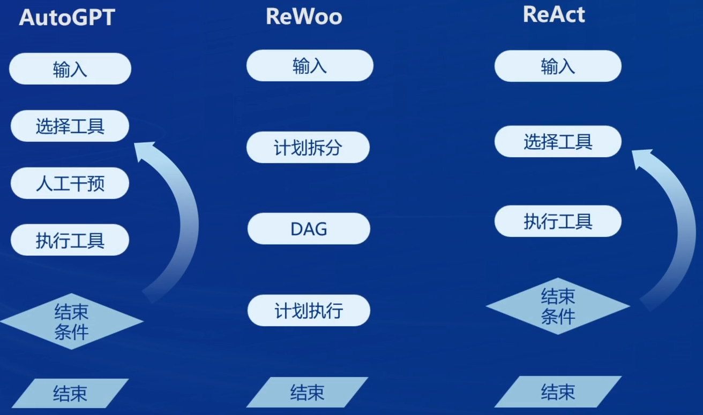
### 6.2.1 AutoGPT 
AutoGPT的基本流程如下所示
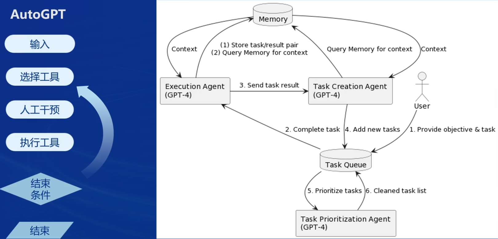
### 6.2.2 ReWoo
下面是ReWoo论文中的图

**ReWoo的工作流程如下**：
* Planner 利用LLMs的可预见推理来构建解决方案的蓝图，包含连续的元组（Plan，#E），其中Plan表示当前步骤的描述信息，#Es是一个特殊标记，用于存储来自相应指定Worker[Instruction]的可能正确证据。
* Worker 通过工具调用使ReWOO与环境进行交互。一旦Planner提供蓝图，指定的Workers将使用指令输入，并填充#Es与真实证据或观察结果。
* Solver处理所有 Planner 和 Worker 的计划和证据，制定原始任务或问题的解决方案，例如在QA任务中提供答案或为操作请求返回工作状态。值得注意的是，提示Solver“谨慎使用”提高了ReWOO的整体性能。这种改进归因于Solver天生的推理能力，可以解决简单任务或部分弥补Planner或Worker的失败。

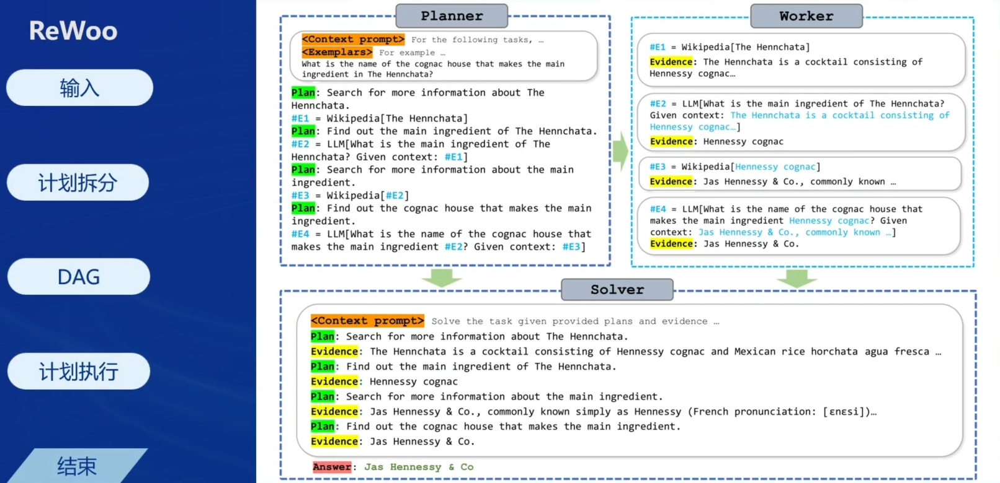
### 6.2.1 ReAct
在接收用户的输入后选择合适的工具执行，在拿到工具结束条件后，模型会思考是否考虑使用下一个工具并且执行，直到完成任务条件。
ReAct包括了推理和行为两部分，更好的实现了智能体的思维模式
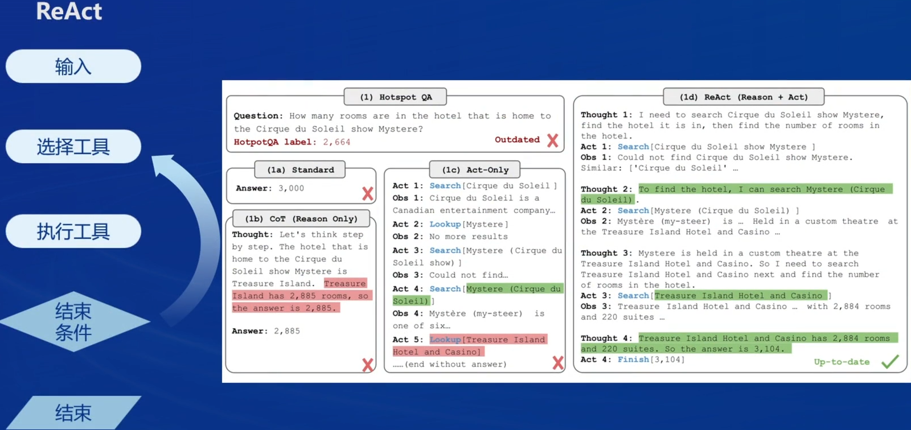

## 6.3 Lagent & AgentLego

### 6.3.1 Lagent

一个轻量级开源智能体框架，旨在让用户可以高效地构建基于大语言模型的智能体。
支持多种智能体范式: (如AutoGPT、ReWoo、ReAct)
支持多种工具: (如谷歌搜索、Python解释器等)

由下图所示，在此框架中，LLM可以获取人类反馈、指令，以及环境观察等
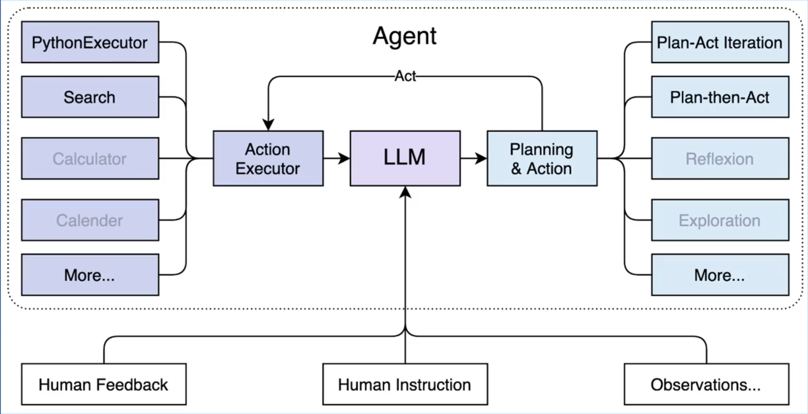

### 6.3.2 AgentLego

一个多模态工具包，旨在像乐高积木，可以快速简便地拓展自定义工具，从而组装出自己的智体。
支持多个智能体框架。(如Lagent、LangChain、Transformers Agents)
提供大量视觉、多模态领域前沿算法。

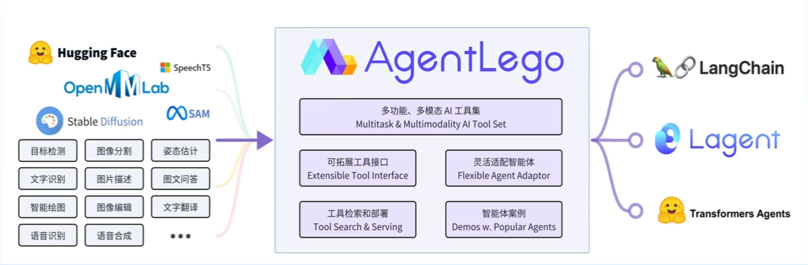

### 6.3.3 Lagent 和 AgentLego 之间的关系

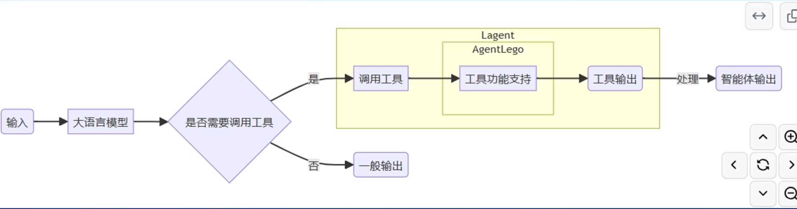

## 6.4 实战一：Lagent Web Demo （**基础作业**）

### 6.4.1 环境搭建
选择Cuda12.2-conda，选择GPU为30%的A100
```bash
mkdir -p /root/agent
# 配置 conda 环境
studio-conda -t agent -o pytorch-2.1.2

# 源码安装 Lagent 和 AgentLego
cd /root/agent
conda activate agent
git clone https://gitee.com/internlm/lagent.git
cd lagent && git checkout 581d9fb && pip install -e . && cd ..
git clone https://gitee.com/internlm/agentlego.git
cd agentlego && git checkout 7769e0d && pip install -e . && cd ..

# pip安装lmdeploy
pip install lmdeploy==0.3.0

#准备 Tutorial 
cd /root/agent
git clone -b camp2 https://gitee.com/internlm/Tutorial.git

```

### 6.4.2 Lagent 的 Web Demo实现
#### 6.4.2.1  lmdeploy部署
```bash
conda activate agent
lmdeploy serve api_server /root/share/new_models/Shanghai_AI_Laboratory/internlm2-chat-7b \
                            --server-name 127.0.0.1 \
                            --model-name internlm2-chat-7b \
                            --cache-max-entry-count 0.1
```
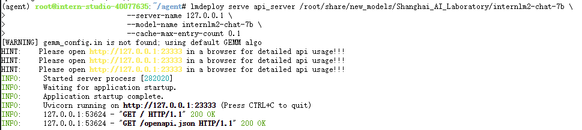

#### 6.4.2.2 启动并使用 Lagent Web Demo
```bash
conda activate agent
cd /root/agent/lagent/examples
streamlit run internlm2_agent_web_demo.py --server.address 127.0.0.1 --server.port 7860
```
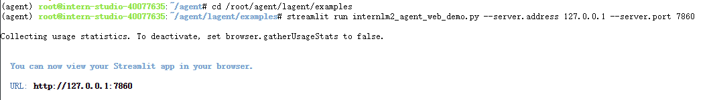

#### 6.4.2.3 端口映射
```bash
ssh -CNg -L 7860:127.0.0.1:7860 -L 23333:127.0.0.1:23333 root@ssh.intern-ai.org.cn -p 你的 ssh 端口号
```
* 完成测试
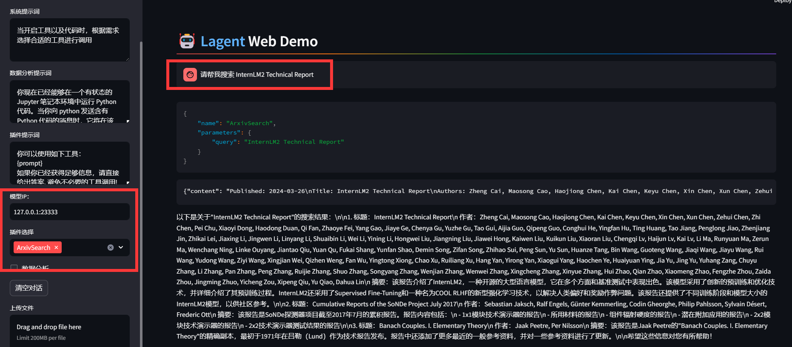


## 6.6 实战三：直接使用 AgentLego（**基础作业**）

AgentLego 算法库既可以直接使用，也可以作为智能体工具使用。
下面将分别介绍这两种使用方式。我们将以目标检测工具为例。

### 6.6.1 环境搭建

```bash
# 下载demo文件
cd /root/agent
wget http://download.openmmlab.com/agentlego/road.jpg

# AgentLego 所实现的目标检测工具是基于 mmdet (MMDetection) 算法库中的 RTMDet-Large 模型
# 因此我们首先安装 mim，然后通过 mim 工具来安装 mmdet。
conda activate agent
pip install openmim==0.3.9
mim install mmdet==3.3.0
```

### 6.6.2 使用目标检测工具

```bash
touch /root/agent/direct_use.py
```

```python
import re

import cv2
from agentlego.apis import load_tool

# load tool
tool = load_tool('ObjectDetection', device='cuda')

# apply tool
visualization = tool('/root/agent/road.jpg')
print(visualization)

# visualize
image = cv2.imread('/root/agent/road.jpg')

preds = visualization.split('\n')
pattern = r'(\w+) \((\d+), (\d+), (\d+), (\d+)\), score (\d+)'

for pred in preds:
    name, x1, y1, x2, y2, score = re.match(pattern, pred).groups()
    x1, y1, x2, y2, score = int(x1), int(y1), int(x2), int(y2), int(score)
    cv2.rectangle(image, (x1, y1), (x2, y2), (0, 255, 0), 1)
    cv2.putText(image, f'{name} {score}', (x1, y1), cv2.FONT_HERSHEY_SIMPLEX, 0.8, (0, 255, 0), 1)

cv2.imwrite('/root/agent/road_detection_direct.jpg', image)
```

## 6.6 实战四：AgentLego WebUI（**进阶作业**）

### 6.6.1 修改相关文件
由于 AgentLego 算法库默认使用 InternLM2-Chat-20B 模型，因此我们首先需要修改 /root/agent/agentlego/webui/modules/agents/lagent_agent.py 文件的第 105行位置，将 internlm2-chat-20b 修改为 internlm2-chat-7b，即
```diff
def llm_internlm2_lmdeploy(cfg):
    url = cfg['url'].strip()
    llm = LMDeployClient(
-         model_name='internlm2-chat-20b',
+         model_name='internlm2-chat-7b',
        url=url,
        meta_template=INTERNLM2_META,
        top_p=0.8,
        top_k=100,
        temperature=cfg.get('temperature', 0.7),
        repetition_penalty=1.0,
        stop_words=['<|im_end|>'])
    return llm
```


### 6.6.2 使用 LMDeploy 部署

由于 AgentLego 的 WebUI 需要用到 LMDeploy 所启动的 api_server，因此我们首先按照下图指示执行如下代码使用 LMDeploy 启动一个 api_server

```bash
conda activate agent
lmdeploy serve api_server /root/share/new_models/Shanghai_AI_Laboratory/internlm2-chat-7b \
                            --server-name 127.0.0.1 \
                            --model-name internlm2-chat-7b \
                            --cache-max-entry-count 0.1
```

```bash
# 启动AgentLego WebUI
conda activate agent
cd /root/agent/agentlego/webui
python one_click.py
```

### 6.6.3 使用 AgentLego WebUI
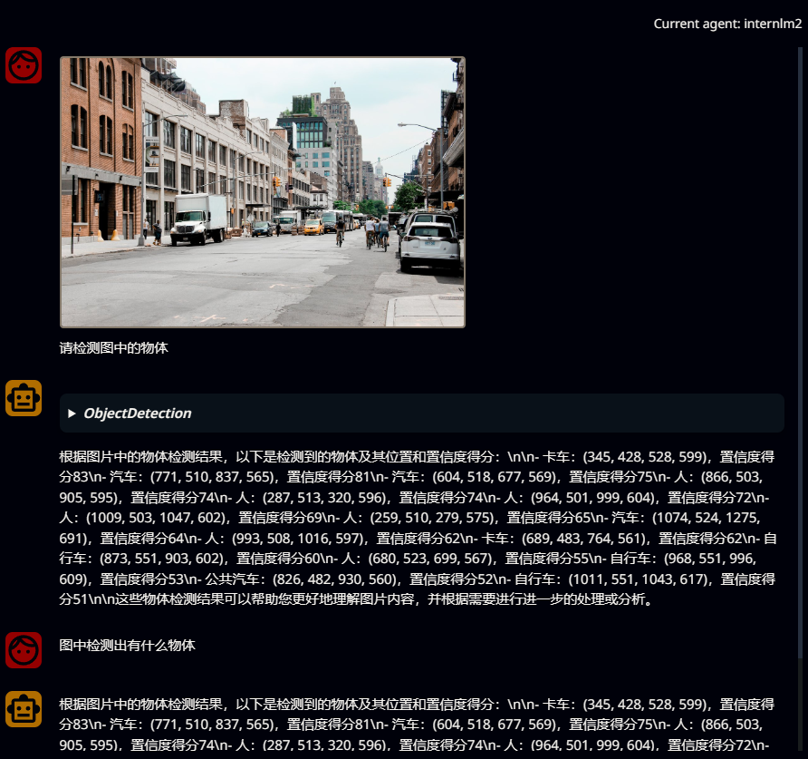

## 6.7 实战五：使用 AgentLego 实现自定义工具并完成调用 （**进阶作业**）

### 6.7.1 创建工具文件
```bash
touch /root/agent/agentlego/agentlego/tools/magicmaker_image_generation.py
```

```python
import json
import requests

import numpy as np

from agentlego.types import Annotated, ImageIO, Info
from agentlego.utils import require
from .base import BaseTool


class MagicMakerImageGeneration(BaseTool):

    default_desc = ('This tool can call the api of magicmaker to '
                    'generate an image according to the given keywords.')

    styles_option = [
        'dongman',  # 动漫
        'guofeng',  # 国风
        'xieshi',   # 写实
        'youhua',   # 油画
        'manghe',   # 盲盒
    ]
    aspect_ratio_options = [
        '16:9', '4:3', '3:2', '1:1',
        '2:3', '3:4', '9:16'
    ]

    @require('opencv-python')
    def __init__(self,
                 style='guofeng',
                 aspect_ratio='4:3'):
        super().__init__()
        if style in self.styles_option:
            self.style = style
        else:
            raise ValueError(f'The style must be one of {self.styles_option}')
        
        if aspect_ratio in self.aspect_ratio_options:
            self.aspect_ratio = aspect_ratio
        else:
            raise ValueError(f'The aspect ratio must be one of {aspect_ratio}')

    def apply(self,
              keywords: Annotated[str,
                                  Info('A series of Chinese keywords separated by comma.')]
        ) -> ImageIO:
        import cv2
        response = requests.post(
            url='https://magicmaker.openxlab.org.cn/gw/edit-anything/api/v1/bff/sd/generate',
            data=json.dumps({
                "official": True,
                "prompt": keywords,
                "style": self.style,
                "poseT": False,
                "aspectRatio": self.aspect_ratio
            }),
            headers={'content-type': 'application/json'}
        )
        image_url = response.json()['data']['imgUrl']
        image_response = requests.get(image_url)
        image = cv2.imdecode(np.frombuffer(image_response.content, np.uint8), cv2.IMREAD_COLOR)
        return ImageIO(image)
```

### 6.7.2 注册新工具
修改`/root/agent/agentlego/agentlego/tools/__init__.py`文件

```diff
from .base import BaseTool
from .calculator import Calculator
from .func import make_tool
from .image_canny import CannyTextToImage, ImageToCanny
from .image_depth import DepthTextToImage, ImageToDepth
from .image_editing import ImageExpansion, ImageStylization, ObjectRemove, ObjectReplace
from .image_pose import HumanBodyPose, HumanFaceLandmark, PoseToImage
from .image_scribble import ImageToScribble, ScribbleTextToImage
from .image_text import ImageDescription, TextToImage
from .imagebind import AudioImageToImage, AudioTextToImage, AudioToImage, ThermalToImage
from .object_detection import ObjectDetection, TextToBbox
from .ocr import OCR
from .scholar import *  # noqa: F401, F403
from .search import BingSearch, GoogleSearch
from .segmentation import SegmentAnything, SegmentObject, SemanticSegmentation
from .speech_text import SpeechToText, TextToSpeech
from .translation import Translation
from .vqa import VQA
+ from .magicmaker_image_generation import MagicMakerImageGeneration

__all__ = [
    'CannyTextToImage', 'ImageToCanny', 'DepthTextToImage', 'ImageToDepth',
    'ImageExpansion', 'ObjectRemove', 'ObjectReplace', 'HumanFaceLandmark',
    'HumanBodyPose', 'PoseToImage', 'ImageToScribble', 'ScribbleTextToImage',
    'ImageDescription', 'TextToImage', 'VQA', 'ObjectDetection', 'TextToBbox', 'OCR',
    'SegmentObject', 'SegmentAnything', 'SemanticSegmentation', 'ImageStylization',
    'AudioToImage', 'ThermalToImage', 'AudioImageToImage', 'AudioTextToImage',
    'SpeechToText', 'TextToSpeech', 'Translation', 'GoogleSearch', 'Calculator',
-     'BaseTool', 'make_tool', 'BingSearch'
+     'BaseTool', 'make_tool', 'BingSearch', 'MagicMakerImageGeneration'
]
```
### 6.7.3 体验自定义工具效果
```bash
# 使用 lmdeploy 部署服务器
conda activate agent
lmdeploy serve api_server /root/share/new_models/Shanghai_AI_Laboratory/internlm2-chat-7b \
                            --server-name 127.0.0.1 \
                            --model-name internlm2-chat-7b \
                            --cache-max-entry-count 0.1
```

```bash
# 本地执行端口映射
ssh -CNg -L 7860:127.0.0.1:7860 -L 23333:127.0.0.1:23333 root@ssh.intern-ai.org.cn -p 你的 ssh 端口号
```

新增工具
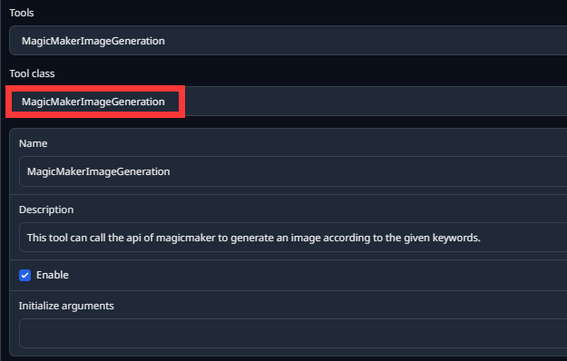

测试效果，截图为证
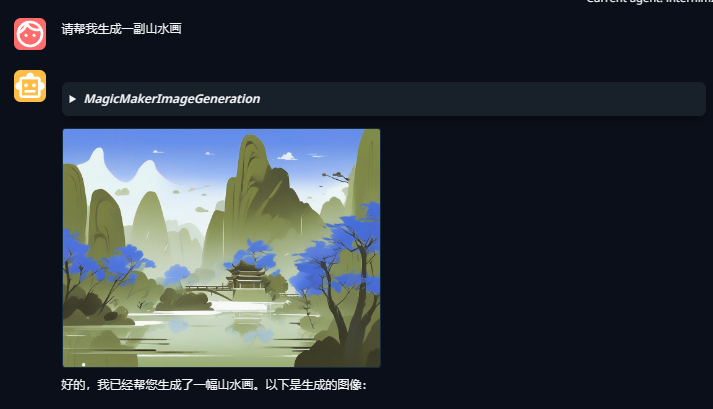
