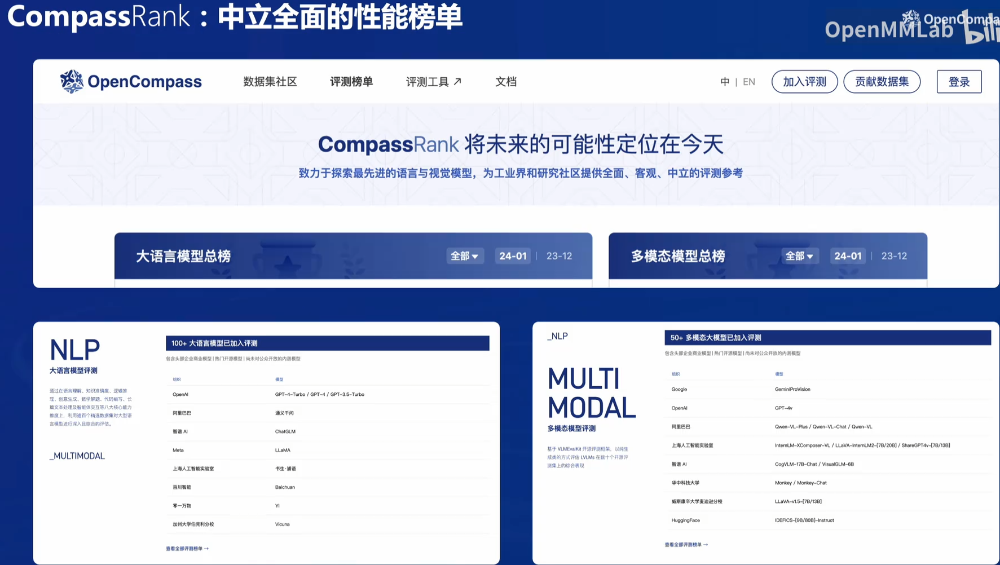

- [Class 7 OpenCompass司南 大模型评测实战](#class-7-opencompass司南-大模型评测实战)
  - [7.1 引言：为什么要做评测](#71-引言为什么要做评测)
    - [7.1.1 在大模型评测中遇到的挑战：](#711-在大模型评测中遇到的挑战)
    - [7.1.2 OpenCompass 2.0 的开源历程](#712-opencompass-20-的开源历程)
    - [7.1.3 OpenCompass贡献：](#713-opencompass贡献)
    - [7.1.4 如何评测大模型？](#714-如何评测大模型)
  - [7.2  评测 internlm2-chat-1\_8b （**基础作业**）](#72--评测-internlm2-chat-1_8b-基础作业)
    - [7.2.1 配置环境](#721-配置环境)
    - [7.2.2 数据评测](#722-数据评测)
    - [7.2.3 启动评测](#723-启动评测)
  - [7.3 将自定义数据集提交至OpenCompass官网（**进阶作业**）](#73-将自定义数据集提交至opencompass官网进阶作业)

# Class 7 OpenCompass司南 大模型评测实战

视频链接：https://www.bilibili.com/video/BV1Pm41127jU/

课程文档：https://github.com/InternLM/Tutorial/blob/camp2/opencompass/readme.md

课程作业：https://github.com/InternLM/Tutorial/blob/camp2/opencompass/homework.md

Github地址：https://github.com/open-compass/opencompass

## 7.1 引言：为什么要做评测

1. 首先，研究评测对于我们全面了解大型语言模型的优势和限制至关重要。尽管许多研究表明大型语言模型在多个通用任务上已经达到或超越了人类水平，但仍然存在质疑，即这些模型的能力是否只是对训练数据的记忆而非真正的理解。例如，即使只提供LeetCode题目编号而不提供具体信息，大型语言模型也能够正确输出答案，这暗示着训练数据可能存在污染现象。
2. 其次，研究评测有助于指导和改进人类与大型语言模型之间的协同交互。考虑到大型语言模型的最终服务对象是人类，为了更好地设计人机交互的新范式，我们有必要全面评估模型的各项能力。
3. 最后，研究评测可以帮助我们更好地规划大型语言模型未来的发展，并预防未知和潜在的风险。随着大型语言模型的不断演进，其能力也在不断增强。通过合理科学的评测机制，我们能够从进化的角度评估模型的能力，并提前预测潜在的风险，这是至关重要的研究内容。
4. 对于大多数人来说，大型语言模型可能似乎与他们无关，因为训练这样的模型成本较高。然而，就像飞机的制造一样，尽管成本高昂，但一旦制造完成，大家使用的机会就会非常频繁。因此，了解不同语言模型之间的性能、舒适性和安全性，能够帮助人们更好地选择适合的模型，这对于研究人员和产品开发者而言同样具有重要意义。
   


### 7.1.1 在大模型评测中遇到的挑战：


### 7.1.2 OpenCompass 2.0 的开源历程


### 7.1.3 OpenCompass贡献：


### 7.1.4 如何评测大模型？

根据模型的不同，分别测评基座模型、开源模型（如Qwen，ChatGLM）、API模型


根据评测方式不同，分为客观评测和主观评测


另外的拓展评测，比如提示词工程


小样本学习和思维链技术


长文本评测


Opencompass 榜单



除此之外，OpenCompass 也是一个全栈工具链，包括数据污染检查，模型推理接入，长文本能力测评，中英文双语主观评测等


评测的流水线，除了自定义模型、自定义数据集，还会对任务切分且并行化，多种输出方案


**多模态评测工具、代码评测、MoE模型入门工具**


CompassHub: 高质量评测基准社区


自研数据集


## 7.2  评测 internlm2-chat-1_8b （**基础作业**）

### 7.2.1 配置环境
```bash
studio-conda -o internlm-base -t opencompass
source activate opencompass
git clone -b 0.2.4 https://github.com/open-compass/opencompass
cd opencompass
pip install -e .

# 如果 pip install -e . 安装未成功
pip install -r requirements.txt
```
有部分第三方功能,如代码能力基准测试 Humaneval 以及 Llama格式的模型评测,可能需要额外步骤才能正常运行，如需评测，详细步骤请参考安装指南。

### 7.2.2 数据评测

解压评测数据集到 opencompass/data/ 处
```bash
cp /share/temp/datasets/OpenCompassData-core-20231110.zip /root/opencompass/
unzip OpenCompassData-core-20231110.zip
# 列出所有跟internlm 及 ceval 相关配置
python tools/list_configs.py internlm ceval
```

### 7.2.3 启动评测

确保按照上述步骤正确安装 OpenCompass 并准备好数据集后，可以通过以下命令评测 InternLM2-Chat-1.8B 模型在 C-Eval 数据集上的性能。由于 OpenCompass 默认并行启动评估过程，我们可以在第一次运行时以 --debug 模式启动评估，并检查是否存在问题。在 --debug 模式下，任务将按顺序执行，并实时打印输出。

```bash
# 可能会报error ，解决办法：
pip install protobuf

python run.py --datasets ceval_gen --hf-path /share/new_models/Shanghai_AI_Laboratory/internlm2-chat-1_8b --tokenizer-path /share/new_models/Shanghai_AI_Laboratory/internlm2-chat-1_8b --tokenizer-kwargs padding_side='left' truncation='left' trust_remote_code=True --model-kwargs trust_remote_code=True device_map='auto' --max-seq-len 1024 --max-out-len 16 --batch-size 2 --num-gpus 1 --debug

# 命令解析
python run.py
--datasets ceval_gen \
--hf-path /share/new_models/Shanghai_AI_Laboratory/internlm2-chat-1_8b \  # HuggingFace 模型路径
--tokenizer-path /share/new_models/Shanghai_AI_Laboratory/internlm2-chat-1_8b \  # HuggingFace tokenizer 路径（如果与模型路径相同，可以省略）
--tokenizer-kwargs padding_side='left' truncation='left' trust_remote_code=True \  # 构建 tokenizer 的参数
--model-kwargs device_map='auto' trust_remote_code=True \  # 构建模型的参数
--max-seq-len 1024 \  # 模型可以接受的最大序列长度
--max-out-len 16 \  # 生成的最大 token 数
--batch-size 2  \  # 批量大小
--num-gpus 1  # 运行模型所需的 GPU 数量
--debug
```

遇到错误mkl-service + Intel(R) MKL MKL_THREADING_LAYER=INTEL is incompatible with libgomp.so.1 ... 

解决方案：
```bash
export MKL_SERVICE_FORCE_INTEL=1
#或
export MKL_THREADING_LAYER=GNU
```

## 7.3 将自定义数据集提交至OpenCompass官网（**进阶作业**）


```markdown
---
- name：Datasets;
- desc：c-eval!!!
- language：-en
- dimension：examination
- sub_dimension:- sub_tag_1
- website：https://arxiv.org/abs/2305.08322
- github：https://github.com/hkust-nlp/ceval
- paper：https://arxiv.org/abs/2305.08322
- release_date:2023
- download_url：https://github.com/hkust-nlp/ceval
- cn: # optional, for chinese version website
    name: c-eval
    desc: c-eval中文数据集
---
## Introduction
This is a dataset for evaluating the performance of Chinese language models on various tasks.
## Meta Data
The data set has
- Question: The body of the question
- A, B, C, D: The options which the model should choose from
- Answer: (Only in dev and val set) The correct answer to the question
- Explanation: (Only in dev set) The reason for choosing the answer.
## Example
## Citation
```@article{huang2023ceval,
title={C-Eval: A Multi-Level Multi-Discipline Chinese Evaluation Suite for Foundation Models}, 
    author={Huang, Yuzhen and Bai, Yuzhuo and Zhu, Zhihao and Zhang, Junlei and Zhang, Jinghan and Su, Tangjun and Liu, Junteng and Lv, Chuancheng and Zhang, Yikai and Lei, Jiayi and  Fu, Yao and Sun, Maosong and He, Junxian},
    journal={arXiv preprint arXiv:2305.08322},
    year={2023}
} ```
```